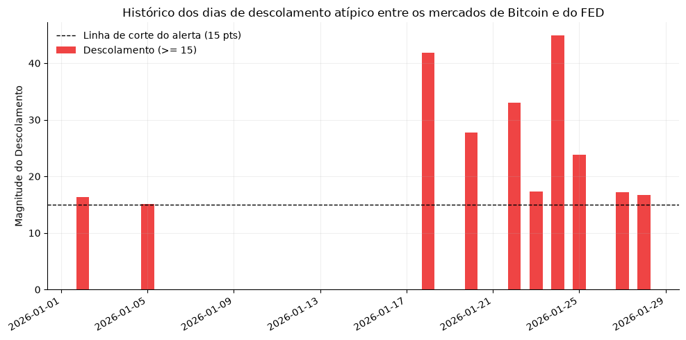
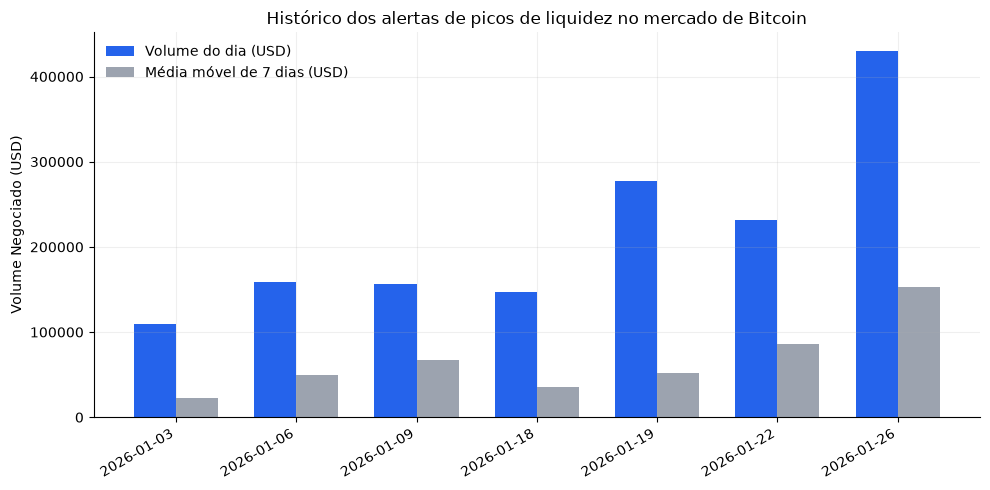

# Entrega de Banco de Dados II - Polymarket

**Ideia geral:** o sentimento do mercado no Polymarket em relação a um certo evento político influencia nas apostas de preço futuro de alguma criptomoeda? Caso haja correlação, seria possível acompanhá-la e identificar movimentos em uma aposta que ainda não foram correspondidos na outra, e vice-versa?

Arquivos CSV: [Pasta do Google Drive](https://drive.google.com/drive/folders/1F1ZdwBjDTMeVoYsdLZeEKGJnmx70TkAR?usp=sharing)

---

O projeto aborda dois eventos: "Fed decision in January?" e "Will Bitcoin reach $150,000 in January?", ambos selecionados com base no volume e, claro, por tratarem do mesmo período de tempo. A pergunta, enunciada na ideia geral acima, busca entender se o movimento de um dos mercados pode afetar o outro (ou vice-versa), visto que o comportamento de ambos os mercados estão teoricamente relacionados conforme a macroeconomia (maior taxa de juros, menor interesse em criptomoedas; menor taxa de juros, maior interesse em criptomoedas). O princípio anterior atua como a hipótese.

Um alerta dessa situação poderia nos daria a possibilidade de enxergar possíveis atrasos na precificação ou anomalias a serem investigadas que talvez pudessem ser uma boa janela de investimento.

### Alertas 

Os dois alertas que selecionei para esse contexto foram:
1. Alerta de descolamento entre o mercado de Bitcoin e o mercado do FED;
2. Alerta de pico de liquidez no mercado de Bitcoin.

Abaixo deixo os resultados de cada um dos alertas, que podem ser vistos com mais detalhes no [relatório](relatorio.ipynb).

  
    
  

### Tabelas usadas

- polymarket_optimized.markets
- polymarket_optimized.trades
- polymarket_mart.v_market_daily

Agradeço a leitura!